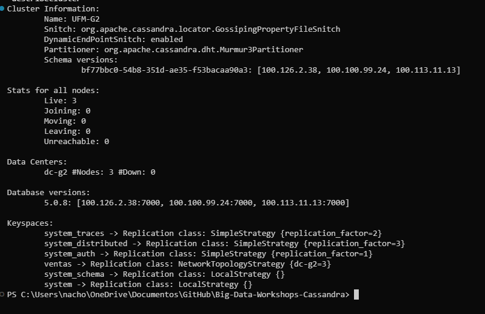
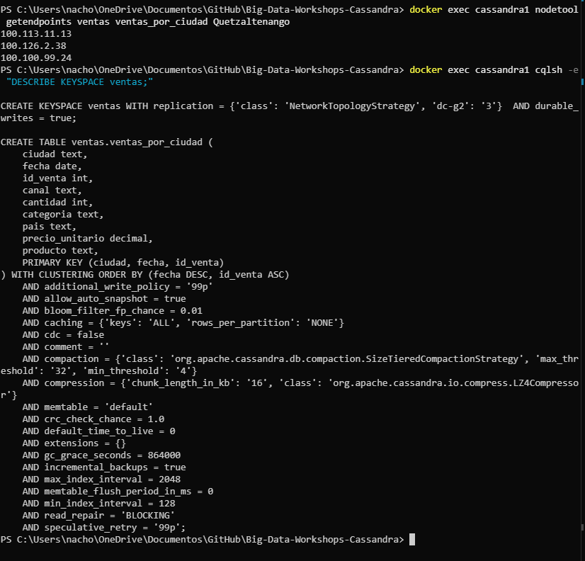
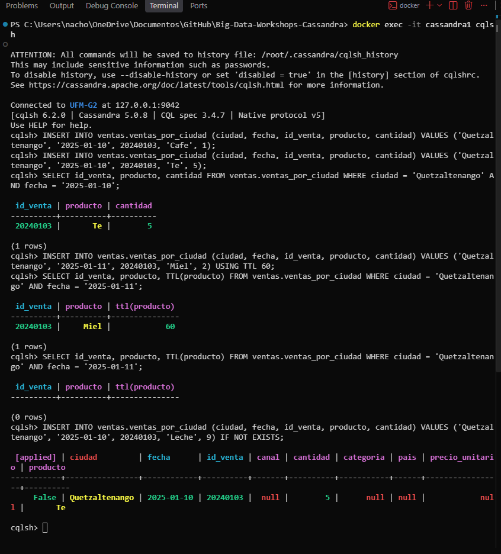
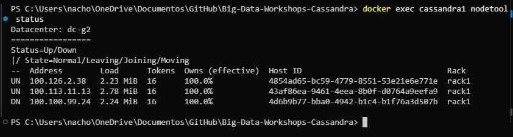
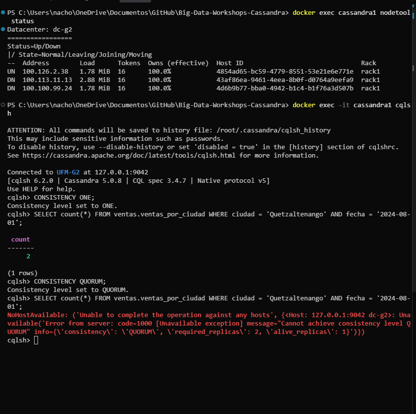
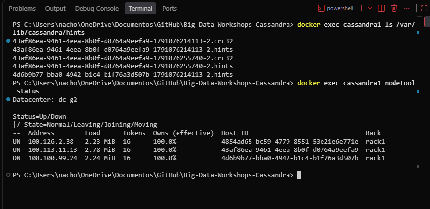
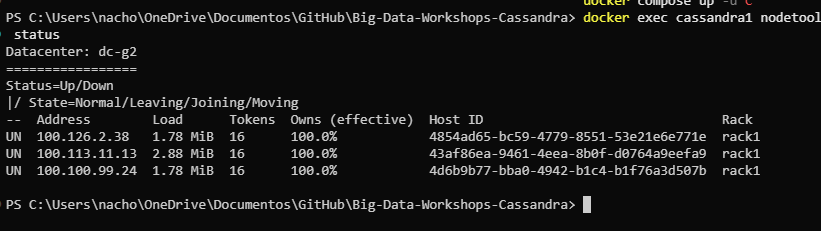

# Bitácora del taller de Cassandra

- **Nombre:** José Ignacio Paccagnella
- **Carné:** 20240103
- **Grupo:** G2
- **Tu nodo en el clúster del grupo:** cassandra1 (semilla), 100.126.2.38

---

## 1. Evidencias

### E1. Tres nodos en tu clúster y tu datacenter

### E2. Las copias de la partición de Quetzaltenango

### E3. Upsert, TTL e IF NOT EXISTS

### E4. Un nodo caído: QUORUM frente a ALL

### E5. Dos nodos caídos: ONE frente a QUORUM

### E6a. El hint guardado para el nodo caído

### E6b. La entrega del hint

### Tabla del Paso 8

| Nodos caídos | `ONE` | `QUORUM` | `ALL` |
|---|---|---|---|
| 0 | ✅ | ✅ | ✅ |
| 1 | ✅ | ✅ | ❌ |
| 2 | ✅ | ❌ | ❌ |

---

## 2. Preguntas

**1. ¿Qué línea de la traza muestra que la consulta por ciudad leyó una sola partición, y cuál que la de producto recorrió toda la tabla? ¿Por qué Cassandra rechaza la segunda sin ALLOW FILTERING?**

En la consulta por ciudad, la traza muestra `Executing single-partition query on ventas_por_ciudad` seguida de `Read 2 live rows and 0 tombstone cells`: Cassandra calculó el hash de `'Quetzaltenango'`, fue directo a esa partición y leyó solo las filas de ese día. En la consulta por producto aparece `Submitting range requests on 49 ranges` y `Executing seq scan across 3 sstables for (min(-9223372036854775808), min(-9223372036854775808)]`, es decir, recorrió el anillo de tokens completo, de punta a punta: hizo un `seq scan` por cada tramo (San José, Alajuela, Quetzaltenango, Tegucigalpa...) y mandó `RANGE_REQ` a `100.100.99.24` y `100.113.11.13` por los tramos que no tenía. La diferencia se ve en mis números: la primera devolvió `count = 2` en unos 5 ms (`source_elapsed 5201`) y la segunda `count = 4929` en más de 550 ms. Sin `ALLOW FILTERING` Cassandra la rechaza porque `producto` no es parte de la llave primaria: no sabe en qué partición está el dato y tendría que leer todas las particiones de todos los nodos, con un costo que crece con la tabla y no se puede predecir.

**2. ¿Qué lecturas se comportaron como CP y cuáles como AP? ¿Qué nivel usarías para el saldo de una cuenta y cuál para un contador de reproducciones, y por qué?**

Según mi tabla, `QUORUM` y `ALL` se comportaron como **CP**: `ALL` se rechazó con 1 y con 2 nodos caídos, y `QUORUM` con 2 caídos. Con `100.100.99.24` y `100.113.11.13` en `DN`, el coordinador respondió `Cannot achieve consistency level QUORUM ... 'required_replicas': 2, 'alive_replicas': 1` en vez de contestar con una sola copia. Con 1 nodo caído `QUORUM` sí respondió, pero sin relajar nada: todavía había mayoría (2 de 3 copias), así que leyó las 2 que exige. `ONE` se comportó como **AP**: respondió en los tres escenarios, y con dos nodos en `DN` igual devolvió `count = 2` usando solo mi nodo, aunque esa única copia podría haber estado desactualizada. Para el saldo de una cuenta usaría `QUORUM` (escribiendo también con `QUORUM`), porque 2 + 2 > 3 garantiza leer la última escritura y es peor mostrar un saldo viejo que fallar. Para un contador de reproducciones usaría `ONE`: importa que siempre responda rápido, y si el número se atrasa unas reproducciones no pasa nada.

**3. ¿Cómo se enteró el nodo apagado de tu venta? ¿Qué pasaría si el nodo estuviera apagado más tiempo que max_hint_window?**

Mi nodo (`cassandra1`, 100.126.2.38) coordinó la escritura con `QUORUM`: la guardó en su copia y en `100.113.11.13`, y para el nodo apagado (`100.100.99.24`, Host ID `4d6b9b77-bba0-4942-b1c4-b1f76a3d507b`, en `DN`) dejó un hint en disco, el archivo `4d6b9b77-bba0-4942-b1c4-b1f76a3d507b-1791076214113-2.hints` en `/var/lib/cassandra/hints`, con el mismo Host ID de la fila `DN`. Cuando ese nodo volvió a `UN`, el registro de mi nodo mostró `Finished hinted handoff of file 4d6b9b77-bba0-4942-b1c4-b1f76a3d507b-1791076214113-2.hints to endpoint /100.100.99.24:7000`: le reenvió la venta y borró el archivo. Si el nodo hubiera estado apagado más que `max_hint_window` (3 horas por defecto), el coordinador deja de guardar hints para él y esas escrituras no le llegarían solas: habría que correr `nodetool repair` para que se ponga al día; mientras tanto, una lectura con `ONE` hacia ese nodo podría devolver datos viejos.

---

## 3. Mini-reto

### Tablas

| Tabla | Consulta que responde | Partition key | Clustering key |
|---|---|---|---|
| `pasajeros` | C1 | `pasajero_id` | (ninguna) |
| `viajes_por_pasajero` | C2 | `pasajero_id` | `inicio DESC`, `viaje_id` |
| `viajes_por_conductor_dia` | C3 | `(conductor_id, dia)` | `inicio ASC`, `viaje_id` |
| `viajes_por_ciudad_dia` | C4 | `(ciudad, dia)` | `inicio ASC`, `viaje_id` |

### Justificación

**Por qué esas llaves:**

- **C1:** el perfil se pide siempre por `pasajero_id`, así que esa es la partition key y cada pasajero es una partición de una fila. No hace falta clustering key.
- **C2:** la consulta filtra por pasajero, así que `pasajero_id` es la partition key y todos sus viajes viven juntos. `inicio DESC` como clustering key deja los viajes ya ordenados del más reciente al más viejo, y `LIMIT 10` toma los primeros sin ordenar nada al leer. `viaje_id` va al final para que dos viajes con el mismo `inicio` no se pisen (upsert).
- **C3:** se pide un conductor **en un día**, así que la partición es `(conductor_id, dia)`: una lectura cae en una sola partición y las particiones no crecen sin límite con los meses. `inicio ASC` devuelve los viajes en orden cronológico, como el `ORDER BY v.inicio` del SQL.
- **C4:** se cuentan viajes de **una ciudad en un día**, así que la partición es `(ciudad, dia)`. Si fuera solo `ciudad`, San José acumularía todos sus viajes en una partición gigante. `inicio` como clustering key permite el rango `inicio >= 17:00 AND inicio < 20:00` dentro de la partición, sin `ALLOW FILTERING`.

**Qué datos quedaron duplicados entre tablas:**

- Cada viaje está guardado **tres veces**: en `viajes_por_pasajero`, en `viajes_por_conductor_dia` y en `viajes_por_ciudad_dia`. `inicio`, `viaje_id` y `distancia_km` se repiten.
- El **nombre del conductor** se copió en cada viaje de `viajes_por_pasajero` (en SQL salía del JOIN con `conductores`).
- El **nombre del pasajero** se copió en cada viaje de `viajes_por_conductor_dia`, y también está en `pasajeros` (JOIN con `pasajeros`).
- El **monto y el método de pago** se copiaron en `viajes_por_pasajero` (JOIN con `pagos`).

**Qué hace la aplicación si cambia un dato duplicado:**

Cassandra no actualiza las copias sola: la aplicación tiene que escribir en **todas** las tablas donde está el dato. Por ejemplo, si un pasajero cambia su nombre, hay que actualizar `pasajeros` y además cada fila de ese pasajero en `viajes_por_conductor_dia`. Para encontrar esas filas, la aplicación primero lee los viajes del pasajero en `viajes_por_pasajero`, que trae `conductor_id`, `inicio` y `viaje_id` (de `inicio` sale el `dia`), y con eso arma la llave completa de cada fila a actualizar. Por eso `viajes_por_pasajero` guarda también el `conductor_id`, aunque C2 no lo muestre. Lo mismo si un conductor cambia de nombre o si se corrige un pago. Conviene agrupar esas escrituras en un `BATCH` lógico (`BEGIN BATCH ... APPLY BATCH`) para que, si una falla, se reintenten todas y las tablas no queden distintas. Para el historial de viajes, otra opción es no actualizar nada y aceptar que un viaje muestre el nombre que la persona tenía cuando lo hizo.

---

## 4. Problemas encontrados (opcional)

